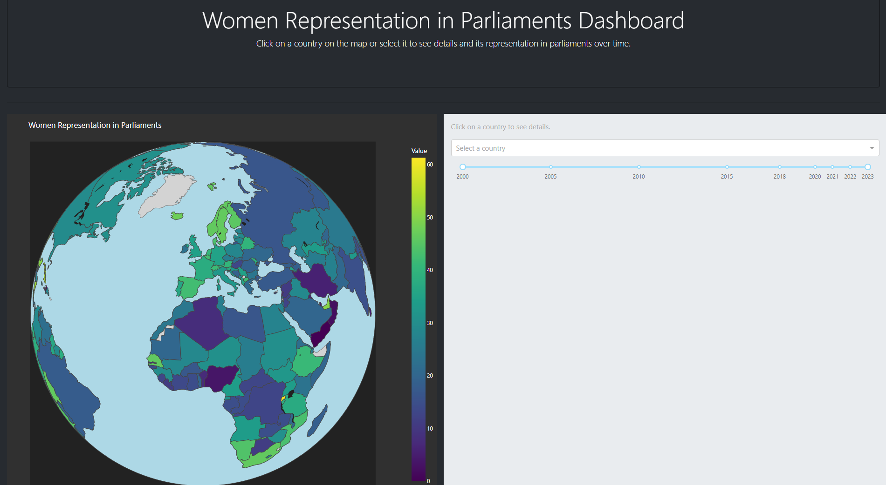
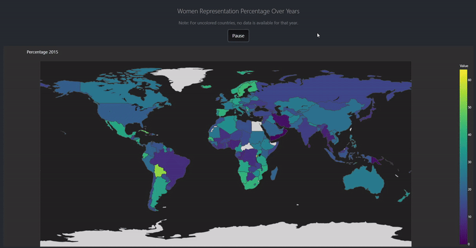
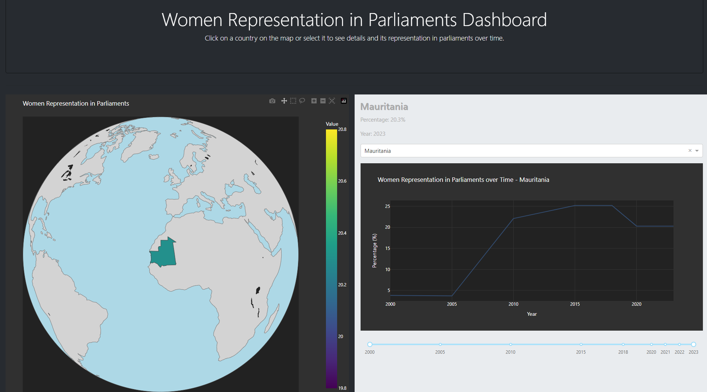

# Women in Parliament Dashboard



Here's a corrected version:

This repository contains a dashboard built with Dash and Plotly for visualizing women's representation in parliaments worldwide.
You can visit the dashboard hosted on Heroku [here](https://dash-app2-a77ab9dd53b7.herokuapp.com/). You can also visit the dashboard on PythonAnywhere [here](https://touradb.pythonanywhere.com/).

## Features

- Interactive map visualization displaying women's representation data by country.
- Line chart showing trends in women's representation over time for selected countries.
- Bar chart displaying women's representation by region.
- Dropdown menu for selecting specific countries to view detailed representation data.
- Built-in filtering and selection based on user interaction with the map.
- Deployed on Heroku and PythonAnywhere for easy accessibility.

## Data Sources

The data used in this dashboard is sourced from the United Nations Statistics Division (UNSD) via the following link:
- [Seats held by women in Parliament](https://data.un.org/_Docs/SYB/CSV/SYB66_317_202310_Seats%20held%20by%20women%20in%20Parliament.csv)

## Repository Structure

```
women-parliament-representation-dashboard/
│
├──── app.py
│──── requirements.txt
│──── data_preparation.ipynb
├── data/
│   ├── cleaned_df.csv
│   └── regions_data.csv
│
└──images/
│   ├── dashboard_preview.png
│   ├── dashboard_preview2.png
│   └── percentage_over_years.gif
└── Procfile
└── .gitignore
└── .gitattributes

```

- **app.py**: Python script for running the Dash application.
- **requirements.txt**: List of Python dependencies required for the application.

- **data/**: Contains the datasets used in the dashboard.
  - **cleaned_df.csv**: Dataset with cleaned data, including coordinates.
  - **regions_data.csv**: Dataset specifically for regional data used in the bar chart.

- **images/**: Contains scrrenshots of the app.
  - **dashboard_preview.png**: Preview image of the dashboard.
  - **dashboard_preview.png2**: Preview image of the dashboard when selecting a country.
  - **percentage_over_years.gif**: GIF that shows variations in percentage over the years.
- **data_preparation.ipynb**: Jupyter notebook for data cleaning, preparation and exploration.
- **Procfile**: File for deploying the app on Heroku.
- **.gitignore**: File to specify which files and directories to ignore.
- **.gitattributes**: File to specify attributes for Git.

## Getting Started

### Percentage Over Years


### Preview image of the dashboard when selecting a country


To access the live dashboard hosted on PythonAnywhere:

Visit the dashboard at [Women in Parliament Dashboard](https://tourad.pythonanywhere.com/).

To run the dashboard locally:

1. Clone this repository:
   ```
   git clone https://github.com/TouradBaba/women-parliament-representation-dashboard.git
   ```
   
2. Navigate to the project directory:
   ```
   cd women-parliament-representation-dashboard
   ```

3. Install the dependencies:
   ```
   pip install -r app/requirements.txt
   ```

4. Run the application:
   ```
   python app/app.py
   ```

5. Open a web browser and go to `http://127.0.0.1:8050/` to view the dashboard.