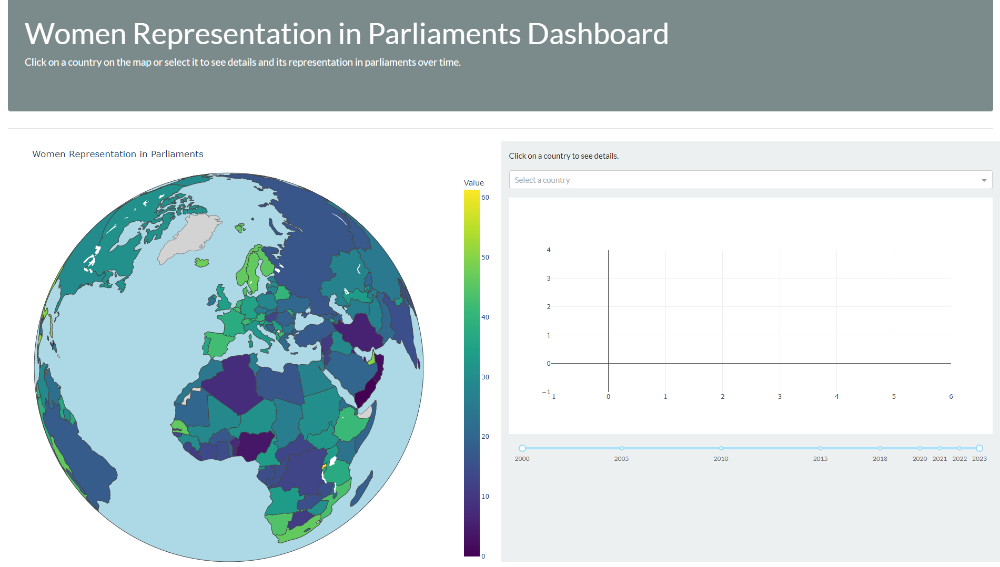
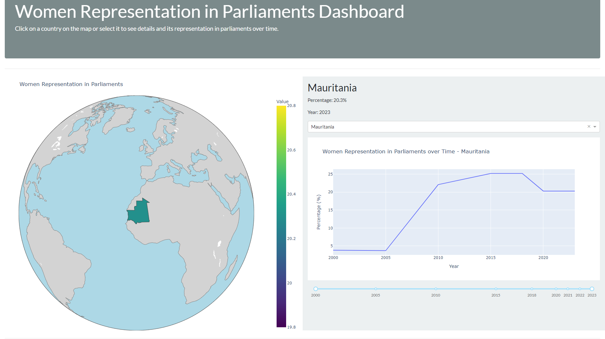

# Women in Parliament Dashboard



This repository contains a dashboard built with Dash and Plotly for visualizing women's representation in parliaments worldwide.
You can visit the dashboard hosted on PythonAnywhere from this [link](https://tourad.pythonanywhere.com/).

## Features

- Interactive map visualization displaying women's representation data by country.
- Line chart showing trends in women's representation over time for selected countries.
- Bar chart displaying women's representation by region.
- Dropdown menu for selecting specific countries to view detailed representation data.
- Built-in filtering and selection based on user interaction with the map.

## Data Sources

The data used in this dashboard is sourced from the United Nations Statistics Division (UNSD) via the following link:
- [Seats held by women in Parliament](https://data.un.org/_Docs/SYB/CSV/SYB66_317_202310_Seats%20held%20by%20women%20in%20Parliament.csv)

## Repository Structure

```
women-parliament-representation-dashboard/
│
├── app/
│   ├── app.py
│   └── requirements.txt
│
├── data/
│   ├── cleaned_df.csv
│   └── regions_data.csv
│
└── dashboard_preview.png
│
└── dashboard_preview2.png
```

- **app/**: Contains the main application files.
  - **app.py**: Python script for running the Dash application.
  - **requirements.txt**: List of Python dependencies required for the application.

- **data/**: Contains the datasets used in the dashboard.
  - **cleaned_df.csv**: Dataset with cleaned data, including coordinates.
  - **regions_data.csv**: Dataset specifically for regional data used in the bar chart.

- **dashboard_preview.png**: Preview image of the dashboard.
- **dashboard_preview.png2**: Preview image of the dashboard when selecting a country

## Getting Started

### Preview image of the dashboard when selecting a country


To access the live dashboard hosted on PythonAnywhere:

1. Visit the dashboard at [Women in Parliament Dashboard](https://tourad.pythonanywhere.com/).

To run the dashboard locally:

1. Clone this repository:
   ```
   git clone https://github.com/TouradBaba/women-parliament-representation-dashboard.git
   ```
   
2. Navigate to the project directory:
   ```
   cd women-parliament-representation-dashboard
   ```

3. Install the dependencies:
   ```
   pip install -r app/requirements.txt
   ```

4. Run the application:
   ```
   python app/app.py
   ```

5. Open a web browser and go to `http://127.0.0.1:8050/` to view the dashboard.
